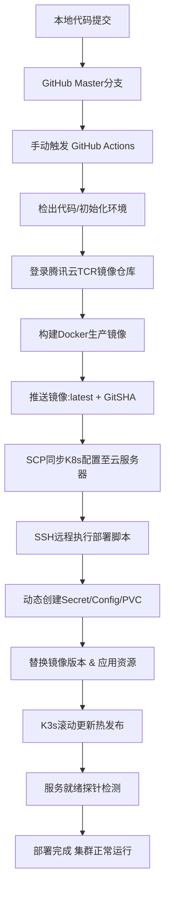

# Identity身份认证服务 部署手册（CI/CD落地版）

## 前言

本手册为Identity身份认证服务**落地部署、CI/CD发布、日常运维**专用实操文档，无冗余技术原理，仅保留部署流程、配置规范、操作步骤、踩坑总结及优化方案。本项目已完整落地部署于腾讯云CVM自建K3s集群，全程依托GitHub Actions实现全自动热发布，部署过程攻克多项环境适配、配置兼容、流水线运行坑点，当前服务运行稳定，可直接作为团队标准化部署运维依据。

## 整体架构与CI/CD部署流程

# 一、项目部署概述

## 1\.1 部署环境基础信息

- **运行集群**：腾讯云CVM 自建 K3s 集群

- **部署方式**：容器化部署 \+ GitHub Actions 全自动CI/CD热发布

- **敏感配置方案**：全量敏感信息托管于GitHub Secrets，流水线动态生成K8s资源，无明文落地

- **服务状态**：已完成全流程落地部署，集群运行正常，支持密钥自动轮转、零停机热更新、新旧密钥兼容验签

## 1\.2 核心部署规范（固定不变）

|配置项|部署规范值|
|---|---|
|容器监听端口|5008|
|集群对外NodePort|30008（腾讯云安全组需放行TCP端口）|
|集群内部服务域名|http://auth\-svc\.identity\.svc\.cluster\.local:5008|
|密钥持久化挂载目录|/app/keys（ReadWriteOnce 单节点读写PVC）|
|配置加载优先级|GitHub Secrets \> K8s环境变量 \> 本地appsettings\.json|
|密钥轮转时间|每日凌晨 05:00（Hangfire自动执行）|
|网络访问模式|当前强制开启HTTP访问，后期接入网关后关闭|

## 1\.3 服务访问地址

- **集群内部微服务调用地址**：http://auth\-svc\.identity\.svc\.cluster\.local:5008

- **外网访问地址**：http://\[腾讯云CVM公网IP\]:30008

- **微服务验签端点**：服务地址/\.well\-known/jwks\.json

**补充说明**：直接访问服务根路径会提示“网页解析失败”，属于正常情况。本服务为后端接口服务，无前端静态页面，不影响认证、验签、密钥轮转等核心功能使用。

## 1\.4 关键特殊配置说明（HTTP适配方案）

OpenIddict 框架**默认强制禁用HTTP访问、仅支持HTTPS协议**，用于保障授权鉴权安全。本项目现阶段为适配K3s集群内网调试、NodePort外网测试场景，已主动关闭HTTPS强制校验，通过配置 `OPENIDDICT__DISABLEENCRYPTION: "true"` 强制开放HTTP访问。

**迭代规划（最终架构设计）**：当前开启NodePort外网暴露、临时放行HTTP访问，属于**纯测试过渡方案**，不作为长期生产架构。本项目整套微服务体系采用标准分层架构：**全网仅 API Gateway 网关层对外开放外网入口**，权限中心（Identity认证服务）、订单、支付等所有业务微服务，**生产环境完全封闭外网、仅允许K8s集群内网访问**。

业务统一请求规范：所有外网客户端、前端请求、第三方对接请求，统一访问**API Gateway外网域名**；网关集成服务注册中心，结合K8s内部服务发现机制，自动识别底层微服务，转发请求至内网对应服务。底层微服务对外无独立IP、无独立端口暴露，完全由网关统一代理。

待网关、注册中心、完整微服务体系开发完成后，本服务需做生产适配调整：1\. 关闭NodePort外网端口暴露，仅保留ClusterIP内网服务模式；2\. 关闭OpenIddict临时HTTP兼容策略，全线内网HTTPS安全访问；3\. 所有验签、服务调用统一走网关内网转发与K8s内部DNS服务发现。

# 二、整体部署架构（落地最终版）

整套部署架构为「K3s轻量化集群 \+ 容器化部署 \+ GitHub Actions手动热发布 \+ 配置密钥分离托管 \+ 自动化密钥运维」架构，无冗余组件、适配中小型微服务集群，架构分层清晰：

1. **代码层**：\.NET 身份认证服务代码，本地开发配置与生产配置完全隔离

2. **CI/CD层**：GitHub Actions流水线，手动触发构建、镜像推送、远程集群部署，支持版本快照回溯

3. **镜像层**：腾讯云TCR私有镜像仓库存储生产镜像，防止镜像泄露

4. **集群资源层**：K3s独立namespace隔离资源，包含命名空间、PVC持久化、ConfigMap静态配置、Secret敏感配置、Deployment容器调度、NodePort服务暴露

5. **数据持久层**：PVC存储密钥文件、SQL Server存储业务数据与Hangfire定时任务数据

6. **运维调度层**：内置Hangfire定时任务，自动完成密钥轮转、过期清理，支持密钥热加载

7. **访问层**：现阶段临时开启NodePort外网端口用于调试；最终生产架构：关闭所有微服务外网暴露，仅网关对外提供访问，底层服务依托K8s服务发现 \+ 网关服务发现实现内网互调

# 三、全套部署文件细节剖析（逐文件落地说明）

本次部署所有K8s资源、流水线脚本均为定制适配K3s\+腾讯云环境，每一份文件配置均为解决对应环境坑点后的最终稳定版本，详细解析如下：

## 3\.1 auth\-namespace\.yaml（命名空间隔离）

核心作用：单独创建 `identity` 命名空间，将身份认证服务所有资源与集群其他业务服务隔离，避免资源冲突、方便批量运维管理。

部署细节：流水线优先执行命名空间创建，支持重复执行，不存在则创建、已存在则跳过。

## 3\.2 auth\-keys\-pvc\.yaml（密钥持久化存储）

核心作用：解决容器重启、重建、更新导致密钥丢失问题，持久化存储OpenIddict签名、加密密钥。

部署细节：采用K3s默认 `local-path` 存储类、ReadWriteOnce权限、1Gi存储空间，适配单节点集群架构；固定挂载容器 `/app/keys` 目录，支撑密钥热加载机制。

## 3\.3 auth\-config\.yaml（静态全局配置）

核心作用：统一托管服务静态运行参数，通过环境变量注入容器，覆盖项目本地配置。

关键核心配置解析：

- `ASPNETCORE_URLS: http://+:5008`：固定容器监听5008端口，绑定所有网卡

- `OPENIDDICT__DISABLEENCRYPTION: "true"`：核心适配配置，关闭OpenIddict强制HTTPS，解决K3s集群HTTP访问报错问题

- `OPENIDDICTSETTINGS__ISSUER`：固定集群内网DNS，统一内部微服务验签地址

- 自定义密钥生命周期：签名密钥90天、加密密钥180天，适配自动轮转策略

## 3\.4 auth\-service\.yaml（服务端口暴露）

核心作用：暴露集群服务端口，实现内外网访问。

部署细节：固定NodePort为30008，精准映射容器5008端口，通过标签精准绑定认证服务Pod，端口全局固定，无需每次部署修改。

## 3\.5 auth\-deployment\.yaml（核心容器调度）

整套部署最核心、坑点最多的配置文件，完全适配本项目定时任务与热更新需求：

- **单副本部署**：replicas=1，彻底规避Hangfire多副本重复执行定时密钥轮转任务的问题

- **特殊滚动更新策略**：maxSurge=0、maxUnavailable=1，单副本场景下实现无停机热更新，解决默认更新策略导致的服务短暂不可用问题

- **文件权限配置**：fsGroup=1654，解决容器无权限读写 `/app/keys` 目录、密钥无法保存的权限坑

- **双层配置注入**：同时加载ConfigMap静态配置\+Secret敏感配置，实现配置分离、安全可控

- **健康探针**：配置存活、就绪探针，自动剔除异常Pod，保障集群服务稳定性

- **资源限制**：限定CPU、内存上下限，防止服务占用集群资源过高导致节点卡顿

## 3\.6 tcr\-secret\.txt（镜像拉取凭证）

核心作用：为K3s集群提供腾讯云TCR私有镜像仓库拉取权限，解决私有镜像拉取失败、Pod启动异常问题，由流水线动态生成密钥，不落地明文。

## 3\.7 deploy\-auth\.yaml（核心CI/CD流水线）

为项目定制的专属部署流水线，修复大量通用流水线bug，是部署稳定的核心保障：

- **触发机制**：仅手动workflow\_dispatch触发，避免代码推送误触发生产部署，保障环境稳定

- **镜像构建优化**：关闭provenance、sbom冗余元数据，彻底解决腾讯云CCR镜像接收假死、构建失败的核心坑点

- **容错机制**：set \-e 开启脚本容错，任意步骤报错立即终止，避免错误部署残留脏资源

- **动态资源创建**：流水线自动删除重建TCR镜像密钥、动态生成数据库/Redis敏感Secret，无需手动维护集群密钥

- **版本精准控制**：以git commit SHA为镜像版本，保证每一次部署版本可追溯、可回滚

- **部署校验**：强制等待集群滚动更新完成，输出Pod、服务状态，部署结果可视化

# 四、部署核心注意事项（落地必看）

8. **外网端口暴露为临时测试方案，生产彻底禁用**：当前30008 NodePort外网端口仅用于初期调试测试。正式生产环境上线、网关架构落地后，**彻底关闭本服务外网暴露**，删除NodePort，仅保留K8s内网ClusterIP访问，所有流量统一由API网关代理转发

9. **禁止多副本部署**：在未改造Hangfire任务分布式锁之前，严格保持单副本，避免密钥重复轮转、数据错乱

10. **端口固定不可修改**：容器5008、外网30008端口全局固化，修改后需同步修改集群Service、网关路由、微服务验签配置

11. **禁止手动修改集群资源**：所有Secret、ConfigMap、Deployment、镜像版本统一由流水线管理，手动修改会导致下次部署覆盖、配置错乱

12. **安全组必须放行端口**：腾讯云CVM安全组需永久放行30008/TCP端口，否则外网无法访问服务

13. **PVC不可随意删除**：PVC存储所有历史密钥，删除后会导致历史验签失效、用户Token无法解析

14. **流水线密钥不可缺失**：GitHub Secrets所有镜像、数据库、服务器凭证缺失会直接导致部署失败，变更凭证需同步更新仓库密钥

# 五、本次部署攻克的核心坑点总结

整套部署经过多轮调试迭代，解决大量环境适配、框架兼容、流水线运行坑点，所有问题均已落地修复：

- **坑点1：OpenIddict默认禁止HTTP访问**：修复：通过配置关闭加密校验，临时适配集群内网HTTP场景

- **坑点2：腾讯云TCR镜像构建推送假死**：修复：关闭镜像多余元数据生成，适配腾讯云镜像仓库兼容规则

- **坑点3：单副本更新服务中断**：修复：定制滚动更新策略，实现单副本零停机热更新

- **坑点4：容器无权限读写密钥目录**：修复：配置fsGroup用户权限，解决PVC挂载读写权限不足问题

- **坑点5：Hangfire多副本任务重复执行**：修复：强制单副本部署，杜绝密钥重复轮转

- **坑点6：敏感配置明文泄露风险**：修复：全量密钥托管GitHub Secrets，流水线动态生成K8s Secret，无明文落地

- **坑点7：镜像版本混乱、无法回滚**：修复：使用Git SHA作为唯一版本号，实现版本可追溯、可快速回滚

- **坑点8：密钥重启丢失、验签失效**：修复：PVC持久化\+热加载机制，Pod重启、更新不丢失密钥，无需重启服务

# 六、部署方案可优化迭代方向

当前方案可稳定生产运行，后续可通过以下优化提升安全性、可用性、运维便捷性：

15. **架构标准化升级（核心迭代）**：接入API网关\+服务注册中心，改造服务暴露模式：废弃NodePort外网端口，改为纯内网ClusterIP模式，实现微服务外网零暴露；关闭OpenIddict临时HTTP兼容配置，内网统一HTTPS；全链路请求收敛至网关统一入口，基于「网关域名/服务名/路由」标准路径转发，落地微服务安全分层架构

16. **任务高可用优化**：为Hangfire增加分布式锁，支持多副本部署，提升服务高可用，避免单副本单点故障

17. **存储优化**：将本地PVC存储升级为高可用云存储，适配集群多节点扩容场景

18. **流水线优化**：增加环境区分（测试/生产）、部署前置校验、部署失败自动回滚机制

19. **监控运维优化**：接入日志收集、监控告警，实时监听密钥轮转状态、服务运行异常

20. **密钥安全优化**：后续可接入专业密钥管理平台，替代本地PVC密钥存储，提升密钥安全性

# 七、前置部署依赖（首次部署必备）

## 7\.1 集群前置准备

1. 腾讯云CVM服务器正常运行，K3s集群初始化完成

2. 腾讯云安全组放行30008端口（TCP协议）

## 7\.2 GitHub Secrets 配置清单

所有生产敏感信息需提前配置至仓库Secrets，流水线自动读取，无需手动修改代码和集群配置：

- 服务器SSH登录凭证、K3s集群访问凭证

- 腾讯云TCR镜像仓库账号密码、镜像仓库地址

- SQL Server数据库地址、密码（业务库\+Hangfire任务库）

- Redis连接配置

- **手动部署**：仅支持GitHub Actions手动触发工作流，仅master分支可执行生产部署，规避误更新风险

# 九、运维操作规范

## 9\.1 日常迭代部署

开发完成后合并代码至master分支，手动触发GitHub Actions流水线部署即可，禁止手动登录集群修改资源。

## 9\.2 版本回滚操作

新版本部署异常时，可通过历史镜像SHA版本重新触发流水线部署，快速回滚至稳定版本。

## 9\.3 密钥运维说明

密钥全自动化轮转、持久化、过期清理，日常无需人工干预，仅验签异常时排查PVC挂载状态、Hangfire任务日志即可。

> （注：部分内容可能由 AI 生成）
